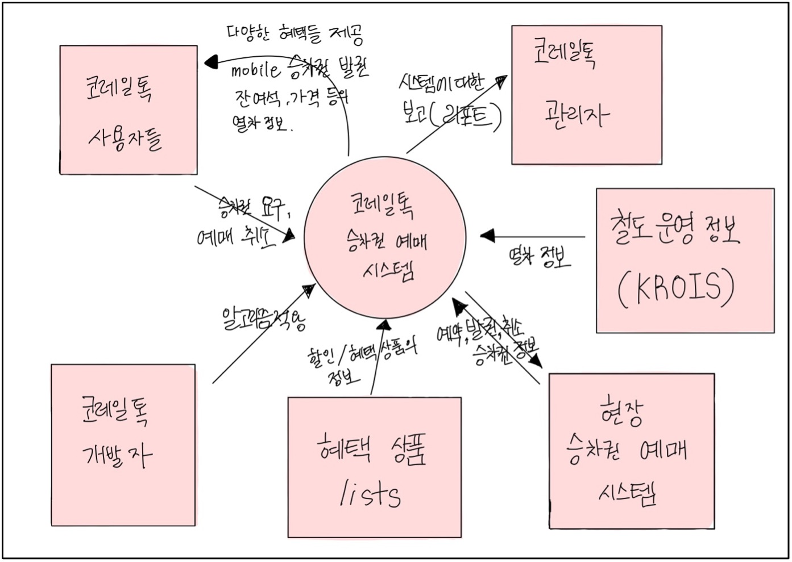
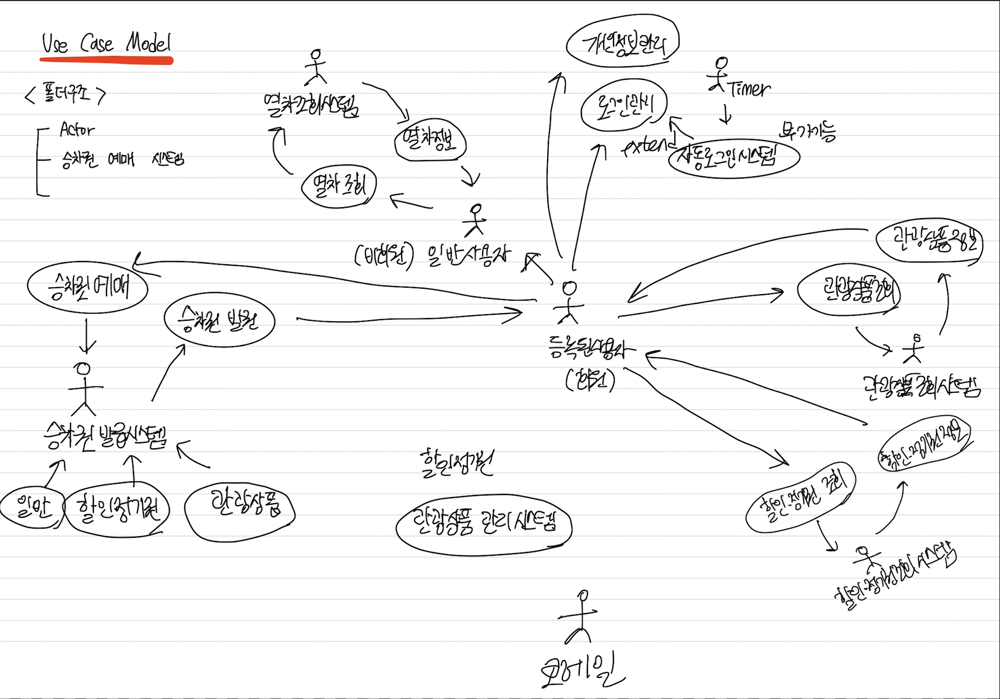
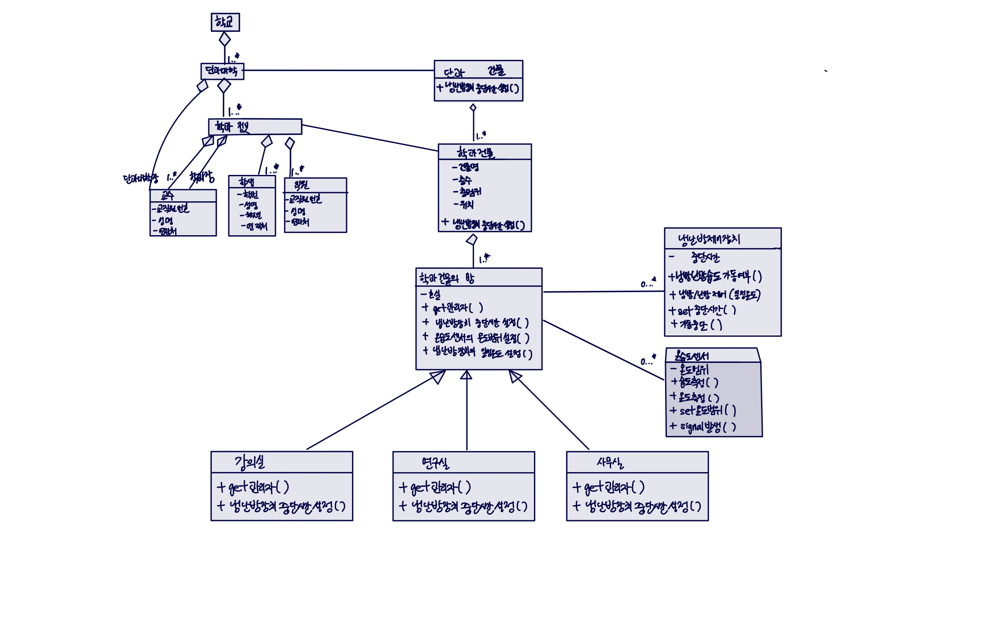

# Software-engineering-study-blog
> ### 부산대학교 3학년 2학기 채흥석 교수님의 『소프트웨어공학』 강의의 실습 내용을 정리한 저장소입니다.
# [소프트웨어공학 Velog](https://velog.io/@diduya/series/%EC%86%8C%ED%94%84%ED%8A%B8%EC%9B%A8%EC%96%B4-%EA%B3%B5%ED%95%99)
# 📁 1 
## ☞ Recent accidents by software
### 📌 설명
- 논문.pdf 는 소프트웨어에 의해서 발생한 최근의 사고를 요약하고 있다. 
- 이 논문을 참고해서 2개의 사고를 선정하여 각 사고에 대해서 
    <pre>
    1) 사고 내용(일자, 장소, 피해 규모 등), 
    2) 사고 원인 분석, 
    3) 재발 방지 대책 
    </pre>
    등을 작성한다.

  
# 📁 2 
## ☞ Requirement Document
### 📌 설명
- 한국철도공사 코레일톡 앱에 대해 Requirement Document를 작성한다.

### 🎨 context model 구상도
- 
  

# 📁 3 
## ☞ Use case diagram 
### 모델링 및 디자인 도구 : [Enterprise Architect](https://sparxsystems.com/)
### 📌 설명
- 한국철도공사 코레일톡 앱에 대해 Use case model를 작성한다.
- Enterprise Architect를 이용하여 아래 내용이 포함된 EA 파일 (.eap or .eapx)을 만든다.
    >  Use case diagram  
    > 각 Actor 및 Use case에 대한 개요: Actor 및 Use case의 Note에 기재
### 🎨 Use case model 구상도
- 

  
# 📁 4 
## ☞ Class diagram
### 모델링 및 디자인 도구 : [Enterprise Architect](https://sparxsystems.com/)
### 📌 설명
- -문서에 기술된 원격 냉난방관리 시스템에 대한 problem statements를 바탕으로 UML class diagram을 만든다.

### 🎨 UML class diagram 구상도
- 

  
